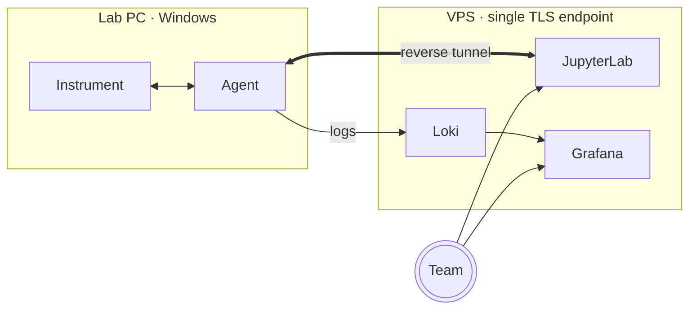

# 🧪 lab-bridge

lab-bridge is the team's private workspace for running bio-experiments and
analyzing results. Open the shared JupyterLab in your browser, drive any
instrument connected through a SerialHop agent on a lab PC, and work in the
same Python environment as the rest of the team.

## Get started

###  [Open JupyterLab →](/lab)

Shared notebooks for analysis and instrument control — the team's main
workspace. Log in with the shared password and pick up where someone else
left off.

> [!NOTE]
> Notebooks drive instruments through
> [`bioexperiment_suite`](https://github.com/khamitovdr/bio_tools), the Python
> library pre-installed in this JupyterLab. Import it from any notebook;
> no extra setup.

###  [Download the SerialHop agent →](/download/agent)

Install on a lab PC to expose its instruments through lab-bridge. Once the
agent is running, the PC's serial/TCP ports become reachable from any
notebook on the team JupyterLab.

Source, releases, and protocol notes on GitHub:
[bioexperiment-lab-devices/serialhop](https://github.com/bioexperiment-lab-devices/serialhop).

## How it fits together

Three pieces, one stack:

- **JupyterLab on the VPS** — the team writes analysis notebooks, hosted
  centrally so everyone shares the same Python environment.
- **The SerialHop agent on each lab PC** — runs on Windows, opens a reverse
  tunnel back to the VPS, and exposes the local instrument's TCP port to the
  notebook network. Notebooks reach instruments as if they were local
  services.
- **Grafana + Loki** — the agent ships its logs through the same tunnel
  into Loki; Grafana renders a per-client dashboard so the operator can
  diagnose remote misbehaviour without needing lab access.

## Need help?

For everyday questions, reach out to the lab-bridge operator
[@khamitov_denis](https://t.me/khamitov_denis).

For operators and tech users: the
 [device logs dashboard](/grafana/)
shows a live tail of every connected agent (errors, versions, traffic) —
filter by client name to see what a specific agent is doing.
