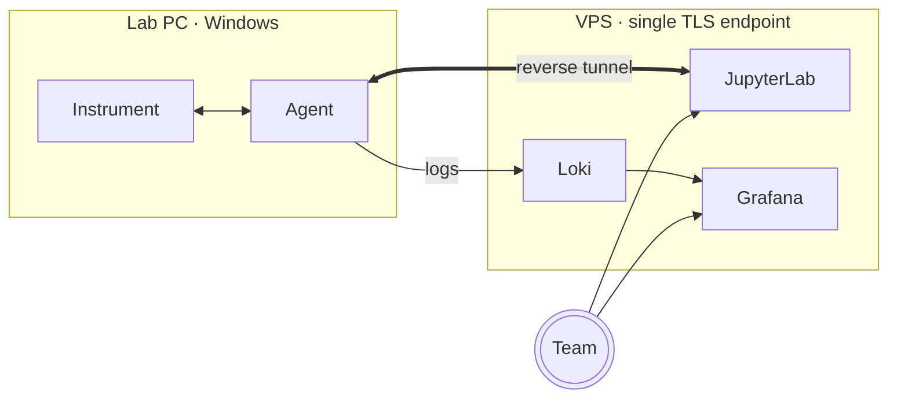

# 🧬 lab-bridge

The bio-experiment lab's private portal — one TLS endpoint that ties together
a shared JupyterLab, the Windows agents that bridge lab instruments to the
notebook network, and the live logs they ship back.

> [!IMPORTANT]
> Everything you see here runs on a single VPS we operate ourselves.
> **No data leaves the box.**

## 🚀 Get started

|     | Destination | What it's for |
| :-: | --- | --- |
|  | **[Open JupyterLab →](/lab)** | Shared notebooks for analysis and instrument control. Use the team password. |
|  | **[Download the Windows agent →](/download/agent)** | Install on a lab PC to connect its instruments to lab-bridge. |
|  | **[Device logs (Grafana) →](/grafana/)** | Live tail of every connected agent: errors, versions, traffic. |
|  | **[`bioexperiment_suite` on GitHub →](https://github.com/khamitovdr/bio_tools)** | The Python package the notebooks import to talk to instruments. |

## How it fits together

Three pieces, one stack:

- **JupyterLab on the VPS** — the team writes analysis notebooks, hosted
  centrally so everyone shares the same Python environment.
- **A Windows agent on each lab PC** — opens a reverse tunnel back to the
  VPS, exposing the local instrument's TCP port to the notebook network.
  Notebooks reach instruments as if they were local services.
- **Grafana + Loki** — the agent ships its logs through the same tunnel
  into Loki; Grafana renders a per-client dashboard so the operator can
  diagnose remote misbehaviour without needing lab access.

## 🆘 Need help?

- 📊 Open the [device logs dashboard](/grafana/) and filter by your client
  name to see what your agent is doing.
- 💬 For everything else, reach out to the lab-bridge operator [@khamitov_denis](https://t.me/khamitov_denis)
