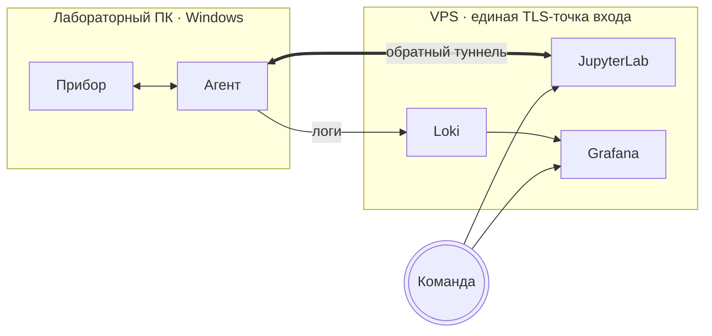

# 🧪 lab-bridge

lab-bridge — приватное рабочее пространство команды для проведения
биоэкспериментов и анализа результатов. Открывайте общий JupyterLab в
браузере, управляйте любым прибором, подключённым через агент SerialHop на
лабораторном ПК, и работайте в едином Python-окружении вместе со всей
командой.

## Начало работы

###  [Открыть JupyterLab →](/lab)

Общие ноутбуки для анализа и управления приборами — основное рабочее
пространство команды. Войдите по общему паролю и продолжите с того места,
где остановился коллега.

> [!NOTE]
> Ноутбуки управляют приборами через
> [`bioexperiment_suite`](https://github.com/khamitovdr/bio_tools) —
> Python-библиотеку, предустановленную в этом JupyterLab. Импортируйте её
> в любом ноутбуке без дополнительной настройки.

###  [Скачать агент SerialHop →](/download/agent)

Установите на лабораторный ПК, чтобы сделать его приборы доступными через
lab-bridge. После запуска агента serial- и TCP-порты ПК становятся доступны
из любого ноутбука в командном JupyterLab.

Исходный код, релизы и описание протокола на GitHub:
[bioexperiment-lab-devices/serialhop](https://github.com/bioexperiment-lab-devices/serialhop).

## Как всё устроено

Три компонента, один стек:

- **JupyterLab на VPS** — команда пишет ноутбуки для анализа; хостинг
  централизованный, поэтому у всех общее Python-окружение.
- **Агент SerialHop на каждом лабораторном ПК** — работает под Windows,
  открывает обратный туннель к VPS и пробрасывает TCP-порт локального
  прибора в сеть ноутбуков. Ноутбуки обращаются к приборам так, будто это
  локальные сервисы.
- **Grafana + Loki** — агент отправляет логи по тому же туннелю в Loki,
  а Grafana отрисовывает дашборд по каждому клиенту, чтобы оператор мог
  диагностировать удалённые сбои без доступа в лабораторию.

## Нужна помощь?

По текущим вопросам пишите оператору lab-bridge —
[@khamitov_denis](https://t.me/khamitov_denis).

Для операторов и технических пользователей:
 [дашборд логов устройств](/grafana/)
показывает живой поток событий по каждому подключённому агенту (ошибки,
версии, трафик) — фильтруйте по имени клиента, чтобы посмотреть, чем
занят конкретный агент.