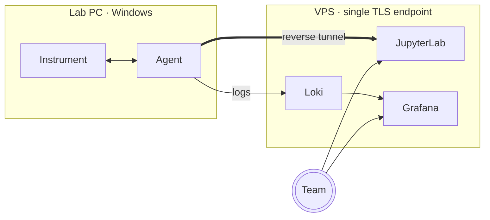

# Docs markdown render extensions — implementation plan

> **For agentic workers:** REQUIRED SUB-SKILL: Use superpowers:subagent-driven-development (recommended) or superpowers:executing-plans to implement this plan task-by-task. Steps use checkbox (`- [ ]`) syntax for tracking.

**Goal:** Extend `compose/siteapp/app/markdown.py` to support GitHub-style alerts (`[!NOTE/TIP/IMPORTANT/WARNING/CAUTION]`), Mermaid flowcharts (client-side), allow-listed inline HTML (`` and friends), and serve doc-relative static assets (icons next to a `.md` file) through the existing `/docs/{path}` route.

**Architecture:** Renderer-first refactor. `render_markdown` is rewritten to return a `Rendered(html, title, needs_mermaid)` dataclass; new behavior layers on top of the existing markdown-it-py + Pygments pipeline (alert post-processor on tokens, Mermaid branch in the highlighter, `bleach` sanitizer on the final HTML). The docs route gains a "non-`.md` static" branch that serves allow-listed image extensions via `FileResponse`. Mermaid runs entirely in the browser; vendored `mermaid.min.js` is loaded only on pages that contain at least one diagram.

**Tech Stack:** Python 3.13 + FastAPI + Uvicorn + Jinja2 + markdown-it-py 3.x + mdit-py-plugins + Pygments. New Python dep: `bleach>=6,<7`. New static assets: `app/static/vendor/mermaid.min.js` (vendored) + `app/static/mermaid-init.js`. No new services.

**Spec:** `docs/superpowers/specs/2026-05-02-md-render-extensions-design.md` — source of truth for behavior. This plan implements that spec verbatim.

---

## Conventions used throughout

- **Working directory** for shell commands is `/Users/khamitovdr/lab_devices_server` unless stated otherwise.
- **siteapp local dev** runs from `compose/siteapp/`; `uv run pytest` and `uv run uvicorn ...` assume that directory.
- Every code block that creates a file shows the *full* file contents (no diffs). Steps that modify an existing file show the full new content of the function/block being changed.
- **Commit style** matches the repo: short imperative subject prefixed with `feat(siteapp):`, `fix(siteapp):`, `test(siteapp):`, `style(siteapp):`, etc. No `Co-Authored-By` trailer (existing siteapp commits don't use one).
- The plan is grouped into six phases. Within each phase, tasks run sequentially; phases are sequential.

---

## Phase 1 — Renderer refactor (Rendered dataclass + bleach + Mermaid + alerts)

All work in `compose/siteapp/app/markdown.py` and `compose/siteapp/tests/test_markdown.py`. Two call sites (`docs.py`, `agent.py`) update once at the start of Phase 1; phases 2+ keep them compatible.

### Task 1: Introduce `Rendered` dataclass return type

Pure refactor. Replace the `(html, title)` tuple return with a frozen dataclass that includes a stub `needs_mermaid: bool = False`. Update both call sites and the existing test suite in one commit so nothing is broken in between.

**Files:**
- Modify: `compose/siteapp/app/markdown.py`
- Modify: `compose/siteapp/app/docs.py`
- Modify: `compose/siteapp/app/agent.py`
- Modify: `compose/siteapp/tests/test_markdown.py`

- [ ] **Step 1: Update `app/markdown.py` to return `Rendered`**

Replace the existing `render_markdown` function (currently at lines 89–94) with:

```python
from dataclasses import dataclass


@dataclass(frozen=True)
class Rendered:
    """Output of `render_markdown`.

    `needs_mermaid` is True iff the source contained at least one
    ` ```mermaid ` fenced block; the page template uses it to decide
    whether to load the vendored Mermaid JS bundle.
    """

    html: str
    title: str | None
    needs_mermaid: bool


def render_markdown(text: str) -> Rendered:
    tokens = _MD.parse(text)
    title = _title_from_tokens(tokens)
    html = _MD.renderer.render(tokens, _MD.options, {})
    return Rendered(html=html, title=title, needs_mermaid=False)
```

Add the `dataclass` import to the top of the file. Leave the rest of `markdown.py` unchanged for this task.

- [ ] **Step 2: Update `app/docs.py` to consume `Rendered`**

In `compose/siteapp/app/docs.py`, replace lines 58–59 (the `render_markdown` call) with:

```python
        result = render_markdown(text)
```

And replace the `templates.TemplateResponse` context dict (lines 62–73) with:

```python
        response = templates.TemplateResponse(
            request,
            "doc.html",
            {
                "title": result.title or doc.rel_path.name,
                "html": result.html,
                "needs_mermaid": result.needs_mermaid,
                "lang": chosen,
                "doc": doc,
                "nav": nav,
                "current_url": str(request.url.path),
                "pygments_css": pygments_css(),
            },
        )
```

- [ ] **Step 3: Update `app/agent.py` to consume `Rendered`**

In `compose/siteapp/app/agent.py`, replace `_body_markdown` (lines 47–56) with:

```python
def _body_markdown(agent_root: Path, lang: str) -> tuple[str | None, bool]:
    """Returns (html, needs_mermaid) — the second flag tells the template
    whether the rendered body contains a Mermaid block."""
    candidates: list[Path] = []
    if lang == "ru":
        candidates.append(agent_root / "page.ru.md")
    candidates.append(agent_root / "page.md")
    for c in candidates:
        if c.is_file():
            result = render_markdown(c.read_text(encoding="utf-8"))
            return result.html, result.needs_mermaid
    return None, False
```

In the same file, update `agent_page` to consume the tuple and pass `needs_mermaid` into the template. Replace lines 64–78 with:

```python
    @router.get("/download/agent")
    def agent_page(request: Request, lang: str | None = None) -> Response:
        chosen = _pick_lang(lang, request.cookies.get("lang"))
        info = load_meta(settings.agent_root)
        body_html, needs_mermaid = _body_markdown(settings.agent_root, chosen)
        ru_body_exists = (settings.agent_root / "page.ru.md").is_file()
        response = templates.TemplateResponse(
            request,
            "agent.html",
            {
                "info": info,
                "body_html": body_html,
                "needs_mermaid": needs_mermaid,
                "lang": chosen,
                "ru_exists": ru_body_exists,
                "pygments_css": pygments_css(),
            },
        )
```

- [ ] **Step 4: Update existing tests in `tests/test_markdown.py`**

Replace the file's entire contents with:

```python
from __future__ import annotations

from app.markdown import render_markdown


def test_returns_html_and_title() -> None:
    r = render_markdown("# Hello\n\nworld\n")
    assert r.title == "Hello"
    assert "<h1" in r.html
    assert "world" in r.html


def test_no_h1_returns_none_title() -> None:
    r = render_markdown("plain paragraph\n")
    assert r.title is None
    assert "<p>plain paragraph" in r.html


def test_raw_html_is_escaped() -> None:
    # html=False in markdown-it: raw HTML in source is rendered as text.
    r = render_markdown("<script>alert(1)</script>\n")
    assert "<script>" not in r.html
    assert "&lt;script&gt;" in r.html


def test_fenced_code_is_highlighted() -> None:
    src = '```python\nprint("hi")\n```\n'
    r = render_markdown(src)
    assert 'class="highlight"' in r.html


def test_table_renders() -> None:
    src = "| a | b |\n|---|---|\n| 1 | 2 |\n"
    r = render_markdown(src)
    assert "<table" in r.html and "<td>1</td>" in r.html


def test_heading_anchor() -> None:
    src = "## My Section\n"
    r = render_markdown(src)
    assert 'id="my-section"' in r.html


def test_unknown_language_still_escapes() -> None:
    src = "```zzznotalang\n<script>alert(1)</script>\n```\n"
    r = render_markdown(src)
    assert "<script>" not in r.html
    assert "&lt;script&gt;" in r.html


def test_h1_inside_fenced_code_not_treated_as_title() -> None:
    src = "Intro paragraph.\n\n```\n# Not a title\n```\n"
    r = render_markdown(src)
    assert r.title is None


def test_h1_with_inline_code_extracts_rendered_text() -> None:
    r = render_markdown("# Use `pip install` carefully\n")
    assert r.title == "Use pip install carefully"


def test_highlighted_code_block_is_not_double_wrapped() -> None:
    """Markdown-it wraps any highlighter output that doesn't start with `<pre`
    in its own `<pre><code>`. Our highlighter must emit a single
    <pre class="highlight"> so markdown-it skips the wrap. Exactly one <pre>
    per fenced block."""
    src = '```python\nprint("hi")\n```\n'
    r = render_markdown(src)
    assert r.html.count("<pre") == 1
    assert r.html.count("</pre>") == 1
    assert '<pre class="highlight">' in r.html


def test_needs_mermaid_default_false() -> None:
    r = render_markdown("# Hello\n\nworld\n")
    assert r.needs_mermaid is False
```

- [ ] **Step 5: Run the full suite to verify nothing regressed**

Run: `cd compose/siteapp && uv run pytest`
Expected: all tests pass (existing 11 + the new `test_needs_mermaid_default_false`).

- [ ] **Step 6: Commit**

```bash
git add compose/siteapp/app/markdown.py compose/siteapp/app/docs.py compose/siteapp/app/agent.py compose/siteapp/tests/test_markdown.py
git commit -m "refactor(siteapp): render_markdown returns Rendered dataclass"
```

---

### Task 2: Add bleach sanitizer + raw inline HTML allow-list

Switch markdown-it `html=False` → `html=True` and pipe the rendered HTML through `bleach.clean` with an explicit allow-list. The existing `test_raw_html_is_escaped` test gets retargeted to the new behavior (the script tag is **stripped**, not escaped), and a new test confirms `` survives sanitization.

**Files:**
- Modify: `compose/siteapp/pyproject.toml`
- Modify: `compose/siteapp/app/markdown.py`
- Modify: `compose/siteapp/tests/test_markdown.py`

- [ ] **Step 1: Add `bleach` to `pyproject.toml`**

In `compose/siteapp/pyproject.toml`, add `"bleach>=6,<7",` to the `dependencies` list. The `[project]` block becomes:

```toml
[project]
name = "siteapp"
version = "0.1.0"
description = "Public docs + agent downloads + admin for lab-bridge."
requires-python = ">=3.13"
dependencies = [
    "fastapi>=0.115,<0.116",
    "uvicorn[standard]>=0.30,<0.31",
    "jinja2>=3.1,<4",
    "markdown-it-py[linkify]>=3.0,<4",
    "mdit-py-plugins>=0.4,<0.5",
    "pygments>=2.18,<3",
    "python-multipart>=0.0.9,<0.1",
    "itsdangerous>=2.2,<3",
    "bleach>=6,<7",
]
```

Run: `cd compose/siteapp && uv sync`
Expected: `bleach` (and its `webencodings` dep) installs into the venv.

- [ ] **Step 2: Write failing tests for the new behavior**

In `compose/siteapp/tests/test_markdown.py`, **replace** the existing `test_raw_html_is_escaped` test (and the `test_unknown_language_still_escapes` script assertion that mirrors it) with the post-sanitizer expectations, and add tests for `` survival and attribute filtering. Append/replace as follows.

Replace:

```python
def test_raw_html_is_escaped() -> None:
    # html=False in markdown-it: raw HTML in source is rendered as text.
    r = render_markdown("<script>alert(1)</script>\n")
    assert "<script>" not in r.html
    assert "&lt;script&gt;" in r.html
```

with:

```python
def test_script_tag_is_stripped() -> None:
    """With html=True + bleach, raw <script> tags are removed entirely.
    The inner text may remain as content (bleach.strip=True), but the
    tag cannot execute."""
    r = render_markdown("<script>alert(1)</script>\n")
    assert "<script>" not in r.html
    assert "</script>" not in r.html


def test_iframe_is_stripped() -> None:
    r = render_markdown('<iframe src="http://evil"></iframe>\n')
    assert "<iframe" not in r.html


def test_img_with_allowed_attrs_survives() -> None:
    src = '\n'
    r = render_markdown(src)
    assert ' None:
    src = '\n'
    r = render_markdown(src)
    assert " None:
    r = render_markdown("Press <kbd>Esc</kbd> to quit.\n")
    assert "<kbd>Esc</kbd>" in r.html
```

Replace `test_unknown_language_still_escapes`:

```python
def test_unknown_language_still_escapes() -> None:
    src = "```zzznotalang\n<script>alert(1)</script>\n```\n"
    r = render_markdown(src)
    assert "<script>" not in r.html
    assert "&lt;script&gt;" in r.html
```

with:

```python
def test_unknown_language_still_escapes() -> None:
    """Inside a fenced code block, the highlighter falls back to escaping;
    bleach then sees an already-safe <pre><code>...&lt;script&gt;... block
    and leaves it alone."""
    src = "```zzznotalang\n<script>alert(1)</script>\n```\n"
    r = render_markdown(src)
    assert "<script>" not in r.html
    assert "&lt;script&gt;" in r.html
```

(content identical — just keeps the test, which still holds because the fence path escapes inside `<pre><code>`.)

Run: `cd compose/siteapp && uv run pytest tests/test_markdown.py -v`
Expected: the new tests `test_script_tag_is_stripped`, `test_iframe_is_stripped`, `test_img_with_allowed_attrs_survives`, `test_img_disallowed_attr_is_stripped`, `test_kbd_inline_passes` all FAIL (because `html=False` still escapes raw HTML).

- [ ] **Step 3: Implement `html=True` + bleach in `app/markdown.py`**

Replace the existing `_make_md` function and the `render_markdown` function with the bleach-sanitizing versions. The full top of `app/markdown.py` becomes:

```python
from __future__ import annotations

import re
from dataclasses import dataclass
from html import escape as html_escape
from html import unescape

import bleach
from markdown_it import MarkdownIt
from mdit_py_plugins.anchors import anchors_plugin
from mdit_py_plugins.footnote import footnote_plugin
from mdit_py_plugins.tasklists import tasklists_plugin
from pygments import highlight
from pygments.formatters import HtmlFormatter
from pygments.lexers import get_lexer_by_name
from pygments.util import ClassNotFound


# --- bleach allow-list ------------------------------------------------------
# Tags markdown-it produces (kept) plus a small set of inline HTML we want
# authors to be able to use directly.
ALLOWED_TAGS: frozenset[str] = frozenset({
    # markdown-produced
    "h1", "h2", "h3", "h4", "h5", "h6",
    "p", "a", "ul", "ol", "li", "blockquote",
    "pre", "code", "table", "thead", "tbody", "tr", "th", "td",
    "hr", "strong", "em", "del", "img", "input", "span", "div",
    # author-allowed inline HTML
    "kbd", "sub", "sup", "br", "details", "summary",
})
ALLOWED_ATTRS: dict[str, set[str]] = {
    "a": {"href", "title", "rel", "target"},
    "img": {"src", "alt", "width", "height", "title", "loading"},
    "input": {"type", "disabled", "checked", "class"},  # tasklists
    "li": {"class"},                                     # tasklists
    "code": {"class"},                                   # highlighted code
    "pre": {"class"},                                    # highlighter + mermaid
    "div": {"class"},                                    # alerts
    "span": {"class"},                                   # anchors
    "h1": {"id"}, "h2": {"id"}, "h3": {"id"},
    "h4": {"id"}, "h5": {"id"}, "h6": {"id"},
}
ALLOWED_PROTOCOLS: frozenset[str] = frozenset({"http", "https"})  # plus relative


def _highlight(code: str, name: str | None, _attrs: object) -> str:
    """Return highlighted code wrapped in our own <pre><code>.

    The output MUST start with `<pre` — markdown-it auto-wraps any
    highlighter output that doesn't, producing nested `<pre>` boxes that
    double-up padding and borders. We use `nowrap=True` to get just the
    Pygments spans, then wrap with a single <pre class="highlight"><code>
    so the .highlight CSS still applies for syntax colors.
    """
    if not name:
        return ""  # let markdown-it fall back to its default (escapes content)
    try:
        lexer = get_lexer_by_name(name)
    except ClassNotFound:
        return ""
    formatter = HtmlFormatter(nowrap=True)
    inner = highlight(code, lexer, formatter).rstrip("\n")
    safe_lang = re.sub(r"[^a-zA-Z0-9_-]", "", name)
    return f'<pre class="highlight"><code class="language-{safe_lang}">{inner}</code></pre>\n'


def _make_md() -> MarkdownIt:
    md = (
        MarkdownIt("commonmark", {"html": True, "linkify": True, "typographer": True})
        .enable(["table", "strikethrough"])
        .use(anchors_plugin, min_level=2, max_level=4, permalink=False, slug_func=_slug)
        .use(footnote_plugin)
        .use(tasklists_plugin, enabled=True)
    )
    md.options["highlight"] = _highlight
    return md


_SLUG_STRIP = re.compile(r"[^\w\s-]")
_SLUG_SPACE = re.compile(r"[\s_]+")


def _slug(s: str) -> str:
    s = unescape(s).strip().lower()
    s = _SLUG_STRIP.sub("", s)
    s = _SLUG_SPACE.sub("-", s)
    return s.strip("-")


_MD = _make_md()


def _inline_text(token) -> str:
    """Concatenate the rendered text of an inline token's children.

    `text` and `code_inline` carry their literal content; other tokens
    (em_open, strong_open, link_open, ...) are markup and contribute nothing
    on their own — their inner text is captured by sibling `text` children.
    """
    if not token.children:
        return token.content
    parts: list[str] = []
    for child in token.children:
        if child.type in ("text", "code_inline"):
            parts.append(child.content)
    return "".join(parts)


def _title_from_tokens(tokens) -> str | None:
    for i, tok in enumerate(tokens):
        if tok.type == "heading_open" and tok.tag == "h1":
            if i + 1 < len(tokens) and tokens[i + 1].type == "inline":
                content = _inline_text(tokens[i + 1]).strip()
                return content or None
            return None
    return None


@dataclass(frozen=True)
class Rendered:
    html: str
    title: str | None
    needs_mermaid: bool


def _sanitize(html: str) -> str:
    return bleach.clean(
        html,
        tags=ALLOWED_TAGS,
        attributes=ALLOWED_ATTRS,
        protocols=ALLOWED_PROTOCOLS,
        strip=True,
    )


def render_markdown(text: str) -> Rendered:
    tokens = _MD.parse(text)
    title = _title_from_tokens(tokens)
    raw_html = _MD.renderer.render(tokens, _MD.options, {})
    return Rendered(html=_sanitize(raw_html), title=title, needs_mermaid=False)
```

Leave the existing `_PYGMENTS_BG_RE`, `_theme_css`, `pygments_css` definitions unchanged at the bottom of the file.

- [ ] **Step 4: Run tests and verify all pass**

Run: `cd compose/siteapp && uv run pytest`
Expected: all tests in `test_markdown.py` pass, and the route tests in `test_routes_docs.py` / `test_routes_agent.py` are unaffected.

- [ ] **Step 5: Commit**

```bash
git add compose/siteapp/pyproject.toml compose/siteapp/uv.lock compose/siteapp/app/markdown.py compose/siteapp/tests/test_markdown.py
git commit -m "feat(siteapp): allow-list inline HTML via bleach (img, kbd, ...)"
```

---

### Task 3: Mermaid highlighter branch + `needs_mermaid` flag

Special-case `name == "mermaid"` inside `_highlight` to emit `<pre class="mermaid">{escaped source}</pre>`, and detect Mermaid blocks via a token walk so `Rendered.needs_mermaid` is set correctly.

**Files:**
- Modify: `compose/siteapp/app/markdown.py`
- Modify: `compose/siteapp/tests/test_markdown.py`

- [ ] **Step 1: Write failing tests for Mermaid behavior**

Append to `compose/siteapp/tests/test_markdown.py`:

```python
def test_mermaid_block_renders_as_pre_mermaid() -> None:
    src = "```mermaid\nflowchart LR\n  A --> B\n```\n"
    r = render_markdown(src)
    assert '<pre class="mermaid">' in r.html
    # Source must be HTML-escaped before being placed in the DOM.
    assert "flowchart LR" in r.html


def test_mermaid_source_is_escaped() -> None:
    src = "```mermaid\nA[\"<script>\"] --> B\n```\n"
    r = render_markdown(src)
    assert "<script>" not in r.html
    assert "&lt;script&gt;" in r.html


def test_needs_mermaid_true_when_block_present() -> None:
    src = "intro\n\n```mermaid\nflowchart LR\n  A --> B\n```\n"
    r = render_markdown(src)
    assert r.needs_mermaid is True


def test_needs_mermaid_false_for_plain_doc() -> None:
    r = render_markdown("# Hello\n\nworld\n")
    assert r.needs_mermaid is False


def test_pygments_languages_unaffected_by_mermaid_branch() -> None:
    src = '```python\nprint("hi")\n```\n'
    r = render_markdown(src)
    assert 'class="highlight"' in r.html
    assert 'class="language-python"' in r.html
```

Run: `cd compose/siteapp && uv run pytest tests/test_markdown.py -v`
Expected: the four new mermaid-related tests FAIL (block renders as plain `<pre><code>`, `needs_mermaid` is hard-coded False).

- [ ] **Step 2: Add the Mermaid branch to `_highlight`**

In `compose/siteapp/app/markdown.py`, replace the body of `_highlight` (the early `if not name` check is the first line) with:

```python
def _highlight(code: str, name: str | None, _attrs: object) -> str:
    """Return highlighted code wrapped in our own <pre><code>.

    Special-cases `mermaid`: emit <pre class="mermaid"> with the source
    HTML-escaped, so the client-side mermaid runtime can pick it up
    without any chance of injecting markup into the page. Pygments is
    skipped for mermaid (the source is a diagram DSL, not code).

    The output MUST start with `<pre` — markdown-it auto-wraps any
    highlighter output that doesn't, producing nested `<pre>` boxes that
    double-up padding and borders. We use `nowrap=True` to get just the
    Pygments spans, then wrap with a single <pre class="highlight"><code>
    so the .highlight CSS still applies for syntax colors.
    """
    if name == "mermaid":
        return f'<pre class="mermaid">{html_escape(code)}</pre>\n'
    if not name:
        return ""  # let markdown-it fall back to its default (escapes content)
    try:
        lexer = get_lexer_by_name(name)
    except ClassNotFound:
        return ""
    formatter = HtmlFormatter(nowrap=True)
    inner = highlight(code, lexer, formatter).rstrip("\n")
    safe_lang = re.sub(r"[^a-zA-Z0-9_-]", "", name)
    return f'<pre class="highlight"><code class="language-{safe_lang}">{inner}</code></pre>\n'
```

- [ ] **Step 3: Detect Mermaid via a token walk in `render_markdown`**

In the same file, add a helper above `render_markdown`:

```python
def _has_mermaid(tokens) -> bool:
    """True if any fenced code block declares language 'mermaid'.

    The markdown-it-py 3.x highlight callback signature is (code, name, attrs)
    and does not receive the parser env, so we cannot side-channel the flag
    out of the highlighter. A token walk is the cleanest equivalent and runs
    in negligible time (linear in token count).
    """
    for tok in tokens:
        if tok.type == "fence" and tok.info:
            first = tok.info.strip().split(maxsplit=1)[0]
            if first == "mermaid":
                return True
    return False
```

And update `render_markdown` to call it:

```python
def render_markdown(text: str) -> Rendered:
    tokens = _MD.parse(text)
    title = _title_from_tokens(tokens)
    needs_mermaid = _has_mermaid(tokens)
    raw_html = _MD.renderer.render(tokens, _MD.options, {})
    return Rendered(html=_sanitize(raw_html), title=title, needs_mermaid=needs_mermaid)
```

- [ ] **Step 4: Run tests and verify all pass**

Run: `cd compose/siteapp && uv run pytest tests/test_markdown.py -v`
Expected: all mermaid tests pass; the existing `test_needs_mermaid_default_false` and `test_pygments_languages_unaffected_by_mermaid_branch` keep working.

- [ ] **Step 5: Commit**

```bash
git add compose/siteapp/app/markdown.py compose/siteapp/tests/test_markdown.py
git commit -m "feat(siteapp): render mermaid blocks as <pre class=mermaid> + needs_mermaid flag"
```

---

### Task 4: GitHub-style alerts post-processor

Walk parsed tokens and rewrite `> [!TYPE]` blockquotes to `<div class="alert alert-{type}">…</div>`. Five types (`NOTE`, `TIP`, `IMPORTANT`, `WARNING`, `CAUTION`); unknown markers leave the blockquote untouched.

**Files:**
- Modify: `compose/siteapp/app/markdown.py`
- Modify: `compose/siteapp/tests/test_markdown.py`

- [ ] **Step 1: Write failing tests for alerts**

Append to `compose/siteapp/tests/test_markdown.py`:

```python
import pytest


@pytest.mark.parametrize(
    "marker,cls",
    [
        ("NOTE", "alert-note"),
        ("TIP", "alert-tip"),
        ("IMPORTANT", "alert-important"),
        ("WARNING", "alert-warning"),
        ("CAUTION", "alert-caution"),
    ],
)
def test_alert_renders_for_each_type(marker: str, cls: str) -> None:
    src = f"> [!{marker}]\n> body text here\n"
    r = render_markdown(src)
    assert f'<div class="alert {cls}">' in r.html
    assert "body text here" in r.html
    # The marker line must be stripped from the rendered body.
    assert f"[!{marker}]" not in r.html


def test_plain_blockquote_unchanged() -> None:
    src = "> just a quote, no marker\n"
    r = render_markdown(src)
    assert "<blockquote>" in r.html
    assert "alert" not in r.html


def test_unknown_marker_leaves_blockquote() -> None:
    src = "> [!FOO]\n> body\n"
    r = render_markdown(src)
    assert "<blockquote>" in r.html
    # The marker text remains visible since we did not transform it.
    assert "[!FOO]" in r.html


def test_marker_inside_fenced_code_is_not_transformed() -> None:
    src = "```\n> [!IMPORTANT]\n> body\n```\n"
    r = render_markdown(src)
    assert '<div class="alert' not in r.html
    # Inside the code block, the literal marker text survives (escaped).
    assert "[!IMPORTANT]" in r.html


def test_alert_preserves_inline_formatting() -> None:
    src = "> [!IMPORTANT]\n> No data **leaves** the box.\n"
    r = render_markdown(src)
    assert '<div class="alert alert-important">' in r.html
    assert "<strong>leaves</strong>" in r.html
```

Run: `cd compose/siteapp && uv run pytest tests/test_markdown.py -v`
Expected: all 7 new alert tests FAIL.

- [ ] **Step 2: Implement the alert post-processor**

In `compose/siteapp/app/markdown.py`, add the following near the other helpers (above `render_markdown`):

```python
_ALERT_TYPES: frozenset[str] = frozenset({"NOTE", "TIP", "IMPORTANT", "WARNING", "CAUTION"})
_ALERT_MARKER_RE = re.compile(
    r"^\[!(?P<type>NOTE|TIP|IMPORTANT|WARNING|CAUTION)\][ \t]*(?:\n|$)"
)


def _apply_alerts(tokens) -> None:
    """Rewrite GitHub-style alert blockquotes to <div class="alert alert-X">.

    For each blockquote whose first inline content begins with `[!TYPE]\n`,
    where TYPE is one of NOTE/TIP/IMPORTANT/WARNING/CAUTION:
      * The blockquote_open / blockquote_close tokens are mutated in place
        to render as <div class="alert alert-{type}">…</div>.
      * The marker line is stripped from the inline content (both the
        `content` field and the corresponding leading children).

    Other blockquotes are untouched. Markers inside fenced code blocks
    cannot match because they are never parsed as blockquotes.
    """
    i = 0
    while i < len(tokens):
        tok = tokens[i]
        if tok.type != "blockquote_open":
            i += 1
            continue

        # Locate the first inline token inside this blockquote.
        # Structure: blockquote_open, paragraph_open, inline, paragraph_close,
        # ..., blockquote_close.
        inline_idx = None
        depth = 1
        j = i + 1
        while j < len(tokens):
            t = tokens[j]
            if t.type == "blockquote_open":
                depth += 1
            elif t.type == "blockquote_close":
                depth -= 1
                if depth == 0:
                    break
            elif t.type == "inline" and inline_idx is None:
                inline_idx = j
            j += 1
        close_idx = j  # blockquote_close index, or len(tokens) if malformed

        if inline_idx is None:
            i = close_idx + 1
            continue

        inline = tokens[inline_idx]
        m = _ALERT_MARKER_RE.match(inline.content)
        if not m:
            i = close_idx + 1
            continue

        alert_type = m.group("type").lower()

        # Strip the marker from the inline source.
        inline.content = inline.content[m.end():]

        # Strip the matching leading children: the marker `text` token, plus
        # any `softbreak` / `hardbreak` directly after it. The surviving
        # children render as the body.
        if inline.children:
            new_children = list(inline.children)
            # Remove leading text token that contains the marker.
            if new_children and new_children[0].type == "text":
                # The marker text token's content equals "[!TYPE]" exactly
                # (markdown-it splits on softbreak).
                if new_children[0].content == f"[!{m.group('type')}]":
                    new_children.pop(0)
                    # Also drop the immediately-following softbreak/hardbreak.
                    if new_children and new_children[0].type in ("softbreak", "hardbreak"):
                        new_children.pop(0)
            inline.children = new_children

        # Mutate the blockquote_open token to render as <div class=...>.
        open_tok = tokens[i]
        open_tok.tag = "div"
        open_tok.attrSet("class", f"alert alert-{alert_type}")

        # Mutate the matching blockquote_close.
        if close_idx < len(tokens):
            close_tok = tokens[close_idx]
            close_tok.tag = "div"

        i = close_idx + 1
```

And wire it into `render_markdown`:

```python
def render_markdown(text: str) -> Rendered:
    tokens = _MD.parse(text)
    _apply_alerts(tokens)
    title = _title_from_tokens(tokens)
    needs_mermaid = _has_mermaid(tokens)
    raw_html = _MD.renderer.render(tokens, _MD.options, {})
    return Rendered(html=_sanitize(raw_html), title=title, needs_mermaid=needs_mermaid)
```

(Note: `_title_from_tokens` runs *after* `_apply_alerts`. That is correct — if anyone ever puts an `[!IMPORTANT]` block before the H1, the H1 still wins.)

- [ ] **Step 3: Run tests and verify all pass**

Run: `cd compose/siteapp && uv run pytest tests/test_markdown.py -v`
Expected: all alert tests pass; previously-passing tests still pass.

If `test_marker_inside_fenced_code_is_not_transformed` fails, the most likely cause is the regex matching against `inline.content` — verify that markdown-it does not include indented or fenced text in `content` for blockquote inlines.

- [ ] **Step 4: Commit**

```bash
git add compose/siteapp/app/markdown.py compose/siteapp/tests/test_markdown.py
git commit -m "feat(siteapp): GitHub-style alert blockquotes ([!NOTE]/[!TIP]/...)"
```

---

## Phase 2 — Conditional Mermaid script in `base.html`

### Task 5: Wire `needs_mermaid` into the page template

The view already passes `needs_mermaid` (Task 1, Step 2/3). Add the `<script>` line to `base.html` and verify it appears only on pages that need it.

**Files:**
- Modify: `compose/siteapp/app/templates/base.html`
- Modify: `compose/siteapp/tests/test_routes_docs.py`

- [ ] **Step 1: Write failing tests for the conditional script**

In `compose/siteapp/tests/test_routes_docs.py`, modify the `client` fixture so the seeded docs include a Mermaid sample, and add two tests. The fixture's docs setup becomes:

```python
    docs.mkdir()
    (docs / "index.md").write_text("# Home\n\nWelcome\n", encoding="utf-8")
    (docs / "intro.md").write_text("# Intro\n\nhello world\n", encoding="utf-8")
    (docs / "intro.ru.md").write_text("# Введение\n\nпривет\n", encoding="utf-8")
    (docs / "diagram.md").write_text(
        "# Diagram\n\n```mermaid\nflowchart LR\n  A --> B\n```\n",
        encoding="utf-8",
    )
    section = docs / "section"
```

(Insert the `diagram.md` write between `intro.ru.md` and `section`.)

Append two tests at the end of the file:

```python
def test_diagram_page_loads_mermaid_script(client: TestClient) -> None:
    r = client.get("/docs/diagram")
    assert r.status_code == 200
    assert "/_static/mermaid-init.js" in r.text


def test_plain_page_does_not_load_mermaid_script(client: TestClient) -> None:
    r = client.get("/docs/intro")
    assert r.status_code == 200
    assert "/_static/mermaid-init.js" not in r.text
```

Run: `cd compose/siteapp && uv run pytest tests/test_routes_docs.py -v`
Expected: both new tests FAIL (`base.html` doesn't reference `mermaid-init.js` yet).

- [ ] **Step 2: Update `base.html`**

Replace the contents of `compose/siteapp/app/templates/base.html` with:

```html
<!doctype html>
<html lang="{{ lang|default('en') }}">
<head>
  <meta charset="utf-8">
  <meta name="viewport" content="width=device-width, initial-scale=1">
  <title>lab-bridge</title>
  <link rel="stylesheet" href="/_static/site.css">
  <style>{{ pygments_css|safe }}</style>
</head>
<body>
  <header class="topbar">
    <a class="brand" href="/">lab-bridge</a>
    
  </header>
  <main></main>
  <footer><a href="/">lab-bridge</a></footer>
  <script src="/_static/copy-code.js" defer></script>
  
  <script src="/_static/mermaid-init.js" type="module" defer></script>
  
</body>
</html>
```

- [ ] **Step 3: Run tests and verify**

Run: `cd compose/siteapp && uv run pytest`
Expected: all tests pass, including the two new ones in `test_routes_docs.py`.

- [ ] **Step 4: Commit**

```bash
git add compose/siteapp/app/templates/base.html compose/siteapp/tests/test_routes_docs.py
git commit -m "feat(siteapp): load mermaid bundle only on pages with diagrams"
```

---

## Phase 3 — Static assets (Mermaid bundle, init script, CSS)

### Task 6: Add `mermaid-init.js`

Tiny dynamic-import shim. No tests — exercised by browser smoke check at the end.

**Files:**
- Create: `compose/siteapp/app/static/mermaid-init.js`

- [ ] **Step 1: Create the file**

Path: `compose/siteapp/app/static/mermaid-init.js`

```javascript
// Loaded only on pages that contain at least one <pre class="mermaid">.
// Dynamically imports the vendored Mermaid bundle, then renders all
// diagrams in place.
import("/_static/vendor/mermaid.min.js").then(() => {
  const dark = matchMedia("(prefers-color-scheme: dark)").matches;
  window.mermaid.initialize({
    startOnLoad: false,
    theme: dark ? "dark" : "default",
    securityLevel: "strict",
  });
  window.mermaid.run({ querySelector: "pre.mermaid" });
});
```

- [ ] **Step 2: Verify the FastAPI static mount serves it**

Run: `cd compose/siteapp && uv run uvicorn app.main:app --port 8765 &`
Then: `curl -sf http://127.0.0.1:8765/_static/mermaid-init.js | head -5`
Expected: file contents print. Stop the server: `kill %1`.

- [ ] **Step 3: Commit**

```bash
git add compose/siteapp/app/static/mermaid-init.js
git commit -m "feat(siteapp): add mermaid-init.js (lazy mermaid loader)"
```

---

### Task 7: Vendor `mermaid.min.js`

Download a pinned release of Mermaid 11.x and commit it under `app/static/vendor/`. The first line is a comment recording the version.

**Files:**
- Create: `compose/siteapp/app/static/vendor/mermaid.min.js`

- [ ] **Step 1: Pin a version and download the bundle**

Use the `unpkg` mirror so the URL itself documents the version. Use **Mermaid 11.4.1** (latest stable at plan-write time; if a later 11.x is current, replace `11.4.1` consistently).

```bash
mkdir -p compose/siteapp/app/static/vendor
curl -fsSL https://unpkg.com/mermaid@11.4.1/dist/mermaid.min.js \
  -o compose/siteapp/app/static/vendor/mermaid.min.js
```

- [ ] **Step 2: Prepend a one-line version header**

Open `compose/siteapp/app/static/vendor/mermaid.min.js` and prepend, on a new first line:

```
/* mermaid 11.4.1 — vendored from https://unpkg.com/mermaid@11.4.1/dist/mermaid.min.js */
```

(Use the same version string you actually downloaded.)

- [ ] **Step 3: Sanity-check the file**

Run:
```bash
head -1 compose/siteapp/app/static/vendor/mermaid.min.js
wc -c  compose/siteapp/app/static/vendor/mermaid.min.js
```
Expected: header line printed; size in the 1.5–3 MB range (uncompressed; gzip wire size is ~600 KB).

- [ ] **Step 4: Update `.gitignore` if needed**

The `.gitignore` should NOT ignore `vendor/`. Run `git status compose/siteapp/app/static/vendor/` — it should list `mermaid.min.js` as untracked. If not, edit `compose/siteapp/.gitignore` and any parent `.gitignore` to remove a `vendor/` rule.

- [ ] **Step 5: Commit**

```bash
git add compose/siteapp/app/static/vendor/mermaid.min.js
git commit -m "feat(siteapp): vendor mermaid.min.js (pinned 11.4.1)"
```

---

### Task 8: CSS for alerts and Mermaid

Append alert + Mermaid styles to `site.css`.

**Files:**
- Modify: `compose/siteapp/app/static/site.css`

- [ ] **Step 1: Append the new CSS rules**

Append to the end of `compose/siteapp/app/static/site.css`:

```css
/* GitHub-style alerts ------------------------------------------------- */
.prose .alert {
  margin: 1em 0;
  padding: 12px 16px;
  border-left: 4px solid var(--alert-accent);
  border-radius: 6px;
  background: color-mix(in srgb, var(--alert-accent) 8%, var(--bg));
}
.prose .alert::before {
  content: var(--alert-label);
  display: block;
  font-weight: 600;
  color: var(--alert-accent);
  margin-bottom: 4px;
}
.prose .alert > :first-child { margin-top: 0; }
.prose .alert > :last-child  { margin-bottom: 0; }
.alert-note      { --alert-accent: #2855ff; --alert-label: "Note"; }
.alert-tip       { --alert-accent: #16a34a; --alert-label: "Tip"; }
.alert-important { --alert-accent: #8b5cf6; --alert-label: "Important"; }
.alert-warning   { --alert-accent: #d97706; --alert-label: "Warning"; }
.alert-caution   { --alert-accent: #dc2626; --alert-label: "Caution"; }

/* Mermaid block reset ------------------------------------------------- */
/* Override .prose pre defaults so the diagram source doesn't render
   inside a code-block frame while loading; once mermaid replaces the
   <pre> with an <svg>, the SVG centers and scales to width. */
.prose pre.mermaid {
  background: transparent;
  border: 0;
  padding: 0;
  text-align: center;
  white-space: pre;
}
.prose pre.mermaid svg { max-width: 100%; height: auto; }
```

- [ ] **Step 2: Verify styles load**

Run: `cd compose/siteapp && uv run uvicorn app.main:app --port 8765 &`
Then: `curl -sf http://127.0.0.1:8765/_static/site.css | tail -25`
Expected: the appended block prints. Kill the server: `kill %1`.

- [ ] **Step 3: Commit**

```bash
git add compose/siteapp/app/static/site.css
git commit -m "style(siteapp): alert callouts + mermaid block reset"
```

---

## Phase 4 — Doc-relative static files in the `/docs/{path}` route

### Task 9: Serve sibling images from `docs_root`

Extend the `/docs/{path:path}` route to serve allow-listed image files (`.svg`, `.png`, `.jpg`, `.jpeg`, `.gif`, `.webp`) when the URL maps to a non-`.md` file inside `docs_root`. Reuses `safe_join` for traversal protection.

**Files:**
- Modify: `compose/siteapp/app/docs.py`
- Modify: `compose/siteapp/tests/test_routes_docs.py`

- [ ] **Step 1: Write failing tests**

In `compose/siteapp/tests/test_routes_docs.py`, extend the `client` fixture so the docs root contains an icon directory. Add to the fixture body, after the existing seed lines:

```python
    icons = docs / "icons"
    icons.mkdir()
    (icons / "jupyter.svg").write_bytes(
        b'<?xml version="1.0"?><svg xmlns="http://www.w3.org/2000/svg" '
        b'width="28" height="28"><circle r="14" cx="14" cy="14" fill="orange"/></svg>'
    )
    (icons / "secret.exe").write_bytes(b"MZ\x90\x00")
```

Append three tests at the end of the file:

```python
def test_doc_static_svg_is_served(client: TestClient) -> None:
    r = client.get("/docs/icons/jupyter.svg")
    assert r.status_code == 200
    assert r.headers["content-type"].startswith("image/svg+xml")
    assert b"<svg" in r.content


def test_doc_static_disallowed_extension_is_404(client: TestClient) -> None:
    r = client.get("/docs/icons/secret.exe")
    assert r.status_code == 404


def test_doc_static_missing_file_is_404(client: TestClient) -> None:
    r = client.get("/docs/icons/nope.svg")
    assert r.status_code == 404
```

Run: `cd compose/siteapp && uv run pytest tests/test_routes_docs.py -v`
Expected: all three new tests FAIL (route only knows `.md`).

- [ ] **Step 2: Add the doc-static branch to `app/docs.py`**

Open `compose/siteapp/app/docs.py`. Update the imports at the top so the file begins with:

```python
from __future__ import annotations

from pathlib import Path
from typing import Literal

from fastapi import APIRouter, Request
from fastapi.responses import FileResponse, RedirectResponse, Response
from starlette.status import HTTP_308_PERMANENT_REDIRECT

from app.config import Settings
from app.markdown import pygments_css, render_markdown
from app.nav import build_nav
from app.paths import safe_join
from app.templates import templates


DOC_STATIC_EXTS: frozenset[str] = frozenset({
    ".svg", ".png", ".jpg", ".jpeg", ".gif", ".webp",
})
```

Replace the directory-redirect branch (currently lines 42–55, the block starting with `if path and not path.endswith("/"):`) with:

```python
        # Resolve the URL once to a candidate filesystem path. safe_join
        # rejects URL-encoded traversal; treat that as a missing doc.
        candidate: Path | None = None
        if path:
            try:
                candidate = safe_join(settings.docs_root, *[p for p in path.split("/") if p])
            except ValueError:
                return Response(status_code=404)

        # Trailing-slash semantics: a directory URL must end with `/` so relative
        # links inside index.md resolve correctly in the browser.
        if path and not path.endswith("/") and candidate is not None and candidate.is_dir():
            return RedirectResponse(
                url=f"/docs/{path}/", status_code=HTTP_308_PERMANENT_REDIRECT
            )

        # Doc-relative static asset (e.g., icons/jupyter.svg next to a .md):
        # serve the file directly when its extension is in the allow-list.
        # Anything outside the allow-list 404s — including .md files, which
        # belong to the markdown render path below.
        if (
            candidate is not None
            and candidate.is_file()
            and candidate.suffix.lower() in DOC_STATIC_EXTS
        ):
            return FileResponse(candidate)
```

(The existing `doc = find_doc(settings.docs_root, path)` lookup directly below this block stays exactly as-is — no need to replace it.)

- [ ] **Step 3: Run tests and verify**

Run: `cd compose/siteapp && uv run pytest tests/test_routes_docs.py -v`
Expected: all tests pass, including the three new ones and the existing
`test_url_encoded_traversal_returns_404_not_redirect`.

- [ ] **Step 4: Commit**

```bash
git add compose/siteapp/app/docs.py compose/siteapp/tests/test_routes_docs.py
git commit -m "feat(siteapp): serve doc-relative images (svg/png/...) from /docs/"
```

---

## Phase 5 — Default content (icons + richer index.md)

### Task 10: Vendor four product SVG icons

Drop simple SVGs into `default_docs/icons/`. Use small, plain marks (28×28 viewBox), licensed for reuse — Simple Icons (CC0) is the easy source. Each file's first line is a comment naming the source.

**Files:**
- Create: `compose/siteapp/app/default_docs/icons/jupyter.svg`
- Create: `compose/siteapp/app/default_docs/icons/windows.svg`
- Create: `compose/siteapp/app/default_docs/icons/grafana.svg`
- Create: `compose/siteapp/app/default_docs/icons/github.svg`

- [ ] **Step 1: Download the four icons from Simple Icons**

```bash
mkdir -p compose/siteapp/app/default_docs/icons
for name in jupyter windows grafana github; do
  curl -fsSL "https://cdn.simpleicons.org/${name}" \
    -o "compose/siteapp/app/default_docs/icons/${name}.svg"
done
```

- [ ] **Step 2: Prepend a license/source comment to each file**

For each of the four files, prepend (as a new first line) an SVG comment naming the source and license:

```
<!-- Source: simpleicons.org · License: CC0 1.0 -->
```

The comment must be inside the file but **before** the `<svg ...>` open tag (an XML comment at file top is valid before the root element). Edit each file accordingly.

- [ ] **Step 3: Verify each file is a valid SVG**

Run:
```bash
for f in compose/siteapp/app/default_docs/icons/*.svg; do
  echo "$f:"; head -2 "$f"; echo
done
```
Expected: each file shows the comment then an `<svg ...>` opening tag.

- [ ] **Step 4: Commit**

```bash
git add compose/siteapp/app/default_docs/icons/
git commit -m "feat(siteapp): vendor jupyter/windows/grafana/github SVG icons"
```

---

### Task 11: Seed full `default_docs/` tree on first deploy + replace `index.md`

Today `load_settings()` only seeds `default_docs/index.md` on first boot (it copies one file to `<site_data>/docs/index.md`). Once the index references `icons/jupyter.svg`, the seeder must also copy the icons directory or the rendered page has broken images. Extend the seed to copy every file under `default_docs/` that doesn't already exist on disk, then drop in the richer `index.md`.

**Files:**
- Modify: `compose/siteapp/app/config.py`
- Modify: `compose/siteapp/app/default_docs/index.md`
- Modify: `compose/siteapp/tests/test_config.py`
- Modify: `compose/siteapp/tests/test_routes_docs.py` (smoke check on the default page)

- [ ] **Step 1: Write a failing test for recursive seeding**

In `compose/siteapp/tests/test_config.py`, append:

```python
def test_seeds_default_icons_when_missing(tmp_path: Path, monkeypatch: pytest.MonkeyPatch) -> None:
    """Fresh deploy must seed every file under default_docs/, not just index.md.
    Otherwise the seeded landing page renders with broken  references."""
    monkeypatch.setenv("SITE_DATA", str(tmp_path))
    monkeypatch.setenv("SITEAPP_AGENT_UPLOAD_TOKEN", "x")
    s = load_settings()
    # The richer default index references icons/*.svg via relative paths.
    seeded_icon = s.docs_root / "icons" / "jupyter.svg"
    assert seeded_icon.is_file()
    assert seeded_icon.read_bytes().startswith(b"<")  # SVG / XML opening
```

Run: `cd compose/siteapp && uv run pytest tests/test_config.py -v`
Expected: `test_seeds_default_icons_when_missing` FAILS (today's seed only copies `index.md`).

- [ ] **Step 2: Make `load_settings()` seed `default_docs/` recursively**

In `compose/siteapp/app/config.py`, replace the existing seed block (lines 46–53, the `# Seed a default index.md ...` comment through `docs_index.write_text(...)`) with:

```python
    # Seed default_docs/ so the public /docs/ landing page returns 200
    # and any assets referenced by the seeded index (icons, etc.) resolve.
    # Per-file gating: each default file is copied iff its destination
    # is missing — so an operator who has authored their own index.md or
    # edited an icon is never overwritten, and a deleted file gets
    # re-seeded on next boot (matching today's behavior for index.md).
    default_dir = Path(__file__).parent / "default_docs"
    if default_dir.is_dir():
        for src in default_dir.rglob("*"):
            if src.is_file():
                rel = src.relative_to(default_dir)
                dst = site_data / "docs" / rel
                if not dst.exists():
                    dst.parent.mkdir(parents=True, exist_ok=True)
                    dst.write_bytes(src.read_bytes())
```

Per-file gating preserves the spirit of the original "never overwrite the operator's index.md" promise while extending it to icons.

- [ ] **Step 3: Update the existing seed test for the new default content**

In `compose/siteapp/tests/test_config.py`, replace the body of `test_seeds_default_index_when_missing` so it asserts on a substring that survives the rewritten default index. Replace:

```python
    assert "Welcome to lab-bridge" in index.read_text(encoding="utf-8")
```

with:

```python
    assert "lab-bridge" in index.read_text(encoding="utf-8")
```

(The new default uses an `<h1>🧬 lab-bridge</h1>`; the substring `lab-bridge` survives any future cosmetic tweaks while still asserting the right file was seeded.)

- [ ] **Step 4: Replace the default `index.md`**

Overwrite `compose/siteapp/app/default_docs/index.md` with:

```markdown
<h1>
  🧬 lab-bridge
</h1>

The bio-experiment lab's private portal — one TLS endpoint that ties together
a shared JupyterLab, the Windows agents that bridge lab instruments to the
notebook network, and the live logs they ship back.

> [!IMPORTANT]
> Everything you see here runs on a single VPS we operate ourselves.
> **No data leaves the box.**

---

## 🚀 Get started

|     | Destination | What it's for |
| :-: | --- | --- |
|  | **[Open JupyterLab →](/lab)** | Shared notebooks for analysis and instrument control. Use the team password. |
|  | **[Download the Windows agent →](/download/agent)** | Install on a lab PC to connect its instruments to lab-bridge. |
|  | **[Device logs (Grafana) →](/grafana/)** | Live tail of every connected agent: errors, versions, traffic. |
|  | **[`bioexperiment_suite` on GitHub →](https://github.com/khamitovdr/bio_tools)** | The Python package the notebooks import to talk to instruments. |

---

## 🧩 How it fits together



Three pieces, one stack:

- **JupyterLab on the VPS** — the team writes analysis notebooks, hosted
  centrally so everyone shares the same Python environment.
- **A Windows agent on each lab PC** — opens a reverse tunnel back to the
  VPS, exposing the local instrument's TCP port to the notebook network.
  Notebooks reach instruments as if they were local services.
- **Grafana + Loki** — the agent ships its logs through the same tunnel
  into Loki; Grafana renders a per-client dashboard so the operator can
  diagnose remote misbehaviour without needing lab access.

---

## 🆘 Need help?

- 📊 Open the [device logs dashboard](/grafana/) and filter by your client
  name to see what your agent is doing.
- 💬 For everything else, reach out to the lab-bridge operator on the team chat.
```

- [ ] **Step 5: Add an end-to-end smoke test**

The existing `client` fixture in `tests/test_routes_docs.py` overrides the docs root with `tmp_path` and seeds its own minimal docs. The new smoke test deliberately uses an empty `tmp_path` so that `load_settings()` runs the seed and the test exercises the seeded `default_docs` content. Append at the end of `tests/test_routes_docs.py`:

```python
def test_default_index_smoke(tmp_path: Path, monkeypatch) -> None:
    """The shipped default_docs/index.md must render with all four
    extensions active: alert div, mermaid pre, sanitized , and
    a working /docs/icons/jupyter.svg URL."""
    monkeypatch.setenv("SITE_DATA", str(tmp_path))
    monkeypatch.setenv("SITEAPP_AGENT_UPLOAD_TOKEN", "x")
    from importlib import reload
    import app.main
    reload(app.main)
    c = TestClient(app.main.app)

    page = c.get("/docs/")
    assert page.status_code == 200
    assert '<div class="alert alert-important">' in page.text
    assert '<pre class="mermaid">' in page.text
    assert 'src="icons/jupyter.svg"' in page.text
    assert "/_static/mermaid-init.js" in page.text

    icon = c.get("/docs/icons/jupyter.svg")
    assert icon.status_code == 200
    assert icon.headers["content-type"].startswith("image/svg+xml")
```

- [ ] **Step 6: Run all tests**

Run: `cd compose/siteapp && uv run pytest`
Expected: all tests pass.

- [ ] **Step 7: Commit**

```bash
git add compose/siteapp/app/config.py compose/siteapp/app/default_docs/index.md compose/siteapp/tests/test_config.py compose/siteapp/tests/test_routes_docs.py
git commit -m "feat(siteapp): seed default_docs/ recursively + richer landing page"
```

---

## Phase 6 — Manual smoke check + final regression run

### Task 12: Browser smoke test

Run the app locally and visually confirm all four features render correctly.

**Files:** none (manual verification)

- [ ] **Step 1: Run the app locally**

```bash
cd compose/siteapp
uv run uvicorn app.main:app --reload --port 8765
```

- [ ] **Step 2: Open `http://127.0.0.1:8765/docs/` in a browser**

Confirm visually:
1. The H1 "🧬 lab-bridge" renders.
2. The `[!IMPORTANT]` block appears as a callout: colored left border + "Important" label, with the body bold-emphasized line "**No data leaves the box.**" rendered as bold.
3. The "Get started" table shows four rows, each with a small icon (~28 px) on the left.
4. The Mermaid flowchart renders as an SVG (boxes + arrows), not as raw text.
5. View page source; confirm `<script src="/_static/mermaid-init.js" type="module" defer>` is present.
6. Inspect a request for `/docs/icons/jupyter.svg` in DevTools → Network: 200, content-type `image/svg+xml`.
7. Toggle the OS dark mode and reload — the alert background, code blocks, and Mermaid diagram all re-theme.

- [ ] **Step 3: Stop the server**

`Ctrl+C` in the terminal running uvicorn.

- [ ] **Step 4: Final regression run**

```bash
cd compose/siteapp
uv run pytest
```
Expected: every test passes.

- [ ] **Step 5: One last lint pass**

```bash
cd compose/siteapp
uv run ruff check app tests
```
Expected: clean (or fix any complaints with `uv run ruff check app tests --fix` and re-run).

- [ ] **Step 6: Final commit if there were any lint fixes**

If ruff fixed anything:

```bash
git add -p
git commit -m "style(siteapp): ruff auto-fixes after render extensions"
```

Otherwise: nothing to commit; the feature is complete on the local branch.

---

## Acceptance criteria (mirror of spec, for sanity checking)

- [ ] `> [!NOTE]`/`[!TIP]`/`[!IMPORTANT]`/`[!WARNING]`/`[!CAUTION]` render to `<div class="alert alert-{type}">…</div>` with the marker line stripped.
- [ ] An unknown marker (e.g. `[!FOO]`) renders as a plain blockquote, marker text intact.
- [ ] A marker inside a fenced code block is left untouched.
- [ ] ` ```mermaid ` blocks render to `<pre class="mermaid">{escaped}</pre>` and the page loads `mermaid-init.js`; pages without diagrams don't.
- [ ] Mermaid diagram source is HTML-escaped (`<` → `&lt;`).
- [ ] `` with `src/alt/width/height/title/loading` survives sanitization. `` keeps the tag, drops the attribute. `<script>` and `<iframe>` are stripped.
- [ ] `/docs/icons/foo.svg` (file present) → 200, `image/svg+xml`. Unknown extension → 404. URL traversal → 404.
- [ ] The shipped `default_docs/index.md` renders all four features end-to-end.

---

## Risk notes

- **Bleach version drift.** Bleach 7.x rewrote internals; we pin `>=6,<7` deliberately. If a future security advisory forces bumping past 6.x, re-test the allow-list (especially `class` survival on `<pre>`/`<code>`/`<input>`/`<li>`).
- **Mermaid bundle size.** ~600 KB gzipped. Loaded only on diagram pages. Revisit if many docs sprout diagrams; v11.x supports modular imports.
