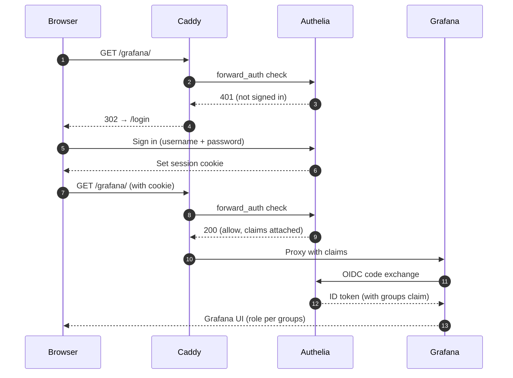

# Authentication and authorization

## Authelia at the edge

Authelia is the identity provider for every protected route in the stack. Caddy enforces access by calling Authelia over `forward_auth` on each request: if the session cookie is missing or invalid, Caddy returns a 302 to the login page; if Authelia approves the request, Caddy attaches the verified claims as headers and proxies to the upstream. The session cookie is scoped to the lab-bridge domain, so signing in once unlocks every protected service.

## Groups and what they unlock

| Group | JupyterLab | Grafana | Flasher (`/flash/*`) |
|-------|------------|---------|----------------------|
| `researchers` | ✓ | ✓ (Viewer role) | ✗ |
| `admins` | ✓ | ✓ (Admin role) | ✓ |

The Grafana role assignment happens via the OIDC `groups` claim — Authelia issues the token with the user's groups, Grafana maps each group to a role at sign-in. Users without a group can authenticate but see no protected pages: every gated route requires `researchers` or `admins`, so the `forward_auth` check rejects them and Caddy redirects to the login page.

## OIDC handshake with Grafana

Grafana is the only upstream that completes a full OIDC code exchange — the other services rely entirely on the `forward_auth` decision and the headers Caddy attaches. Grafana needs the token so it can read the `groups` claim itself and assign the matching role.

## Login flow files

- Login form lives at `/login` (rendered by siteapp).
- Form posts to `/api/auth/*`, which siteapp proxies to Authelia's first-factor endpoint.
- Logout: `/logout` clears the session cookie and redirects home.

## Where users live

User records live in `compose/authelia/users_database.yml`. Admin commands for adding users, resetting passwords, and changing group membership live under `task users:*`. The full administrator walkthrough is at [users and groups](/docs/admin/users-and-groups).
