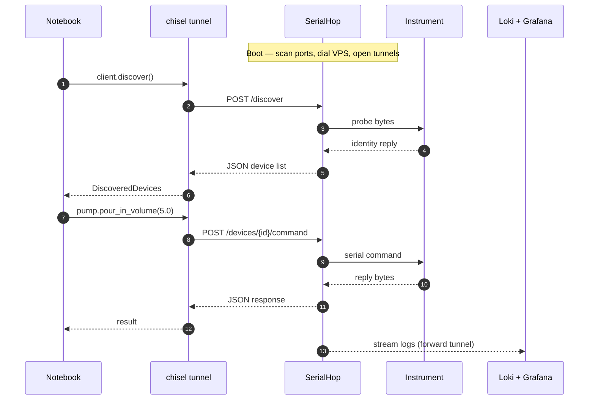

# End-to-end data flow

A single device call traverses notebook → chisel tunnel → SerialHop → serial bus → instrument, and the reply travels the same path back. This page walks one device command through the stack so it is clear which component owns which step, and how logs leave the lab in parallel.

## Sequence diagram

## What happens at each hop

1. **Lab PC boot.** SerialHop starts as a Windows service, scans the lab PC's serial ports for connected instruments, and opens its outbound chisel session to the VPS. Once the session is up, the lab's REST API is reachable inside `labnet` by container DNS, and the forward tunnel for log shipping is live.
2. **Notebook discover.** From a notebook, `client.discover()` becomes a `POST /discover` over the chisel reverse tunnel into SerialHop. SerialHop probes each serial port with vendor-specific identity queries, builds a JSON device list, and returns it. The Python client wraps the response as `DiscoveredDevices`, which the researcher then unpacks into typed device objects (`pump`, `valve`, `densitometer`, …).
3. **Device command.** A call like `pump.pour_in_volume(5.0)` becomes a `POST /devices/{id}/command` over the same tunnel. SerialHop translates the command into the device's serial protocol, writes the bytes, and reads the reply when one is expected. The JSON response carries the reply bytes (decoded into the appropriate type) back through chisel to the notebook.
4. **Log shipping.** In parallel with the request path, SerialHop streams its own structured logs through the chisel forward tunnel into Loki. Grafana's lab-client-logs dashboard reads them straight out of Loki, so operators can watch what each lab agent is doing in near-real-time without anyone touching the lab PC.
