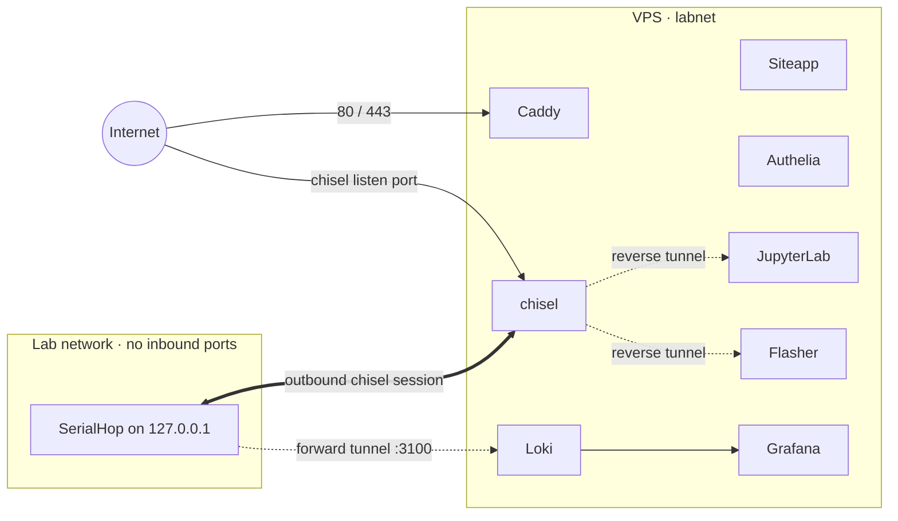

# Architecture

## Single-stack philosophy

lab-bridge is a single Docker Compose stack running on one VPS, fronted by a single Caddy edge that terminates TLS and routes every request. Lab PCs never accept inbound connections; each one dials out to the VPS over chisel and the VPS reaches back through that one tunnel. Nothing in the lab network needs a hole in its firewall, and the platform has exactly one public hostname to defend. The live preprod deployment runs at `https://111.88.145.138/`.

## Components at a glance

- `caddy` — TLS edge on 80/443, reverse-proxies every other service, injects the shared navbar.
- `siteapp` — FastAPI app that serves the home page, public docs, login form, agent download, and public/agent APIs.
- `authelia` — Identity provider for the stack; backs Caddy `forward_auth` and Grafana OIDC.
- `flasher` — Firmware library and flashing UI under `/flash/*`.
- `jupyter` — Shared JupyterLab under `/jupyter/*` where researchers run notebooks.
- `chisel` — Public chisel server; multiplexes reverse and forward tunnels for every lab PC.
- `loki` — Internal log aggregator; receives shipped logs from each SerialHop instance.
- `grafana` — Internal dashboards under `/grafana/*`, provisioned against Loki and Prometheus.
- `prometheus` — Internal metrics scrape for the stack and the host.
- `node-exporter` — Host-level metrics for the VPS itself.
- `cadvisor` — Per-container metrics for every service on `labnet`.

[Per-service detail →](/docs/architecture/services)

## How a request flows

Browser traffic enters at Caddy on 80/443 and is dispatched per the route table. Protected paths are gated by Authelia before they reach the upstream. Lab traffic enters separately at the chisel listen port: each SerialHop holds one outbound TCP session, and chisel uses it to publish that lab's REST API into `labnet` (so JupyterLab and Flasher can call it by container DNS) and to carry a forward tunnel back to Loki for log shipping. Service-to-service calls inside `labnet` use Docker DNS and never leave the VPS. For a step-by-step trace of one device command from notebook to instrument and back, see [end-to-end data flow](/docs/architecture/data-flow).
