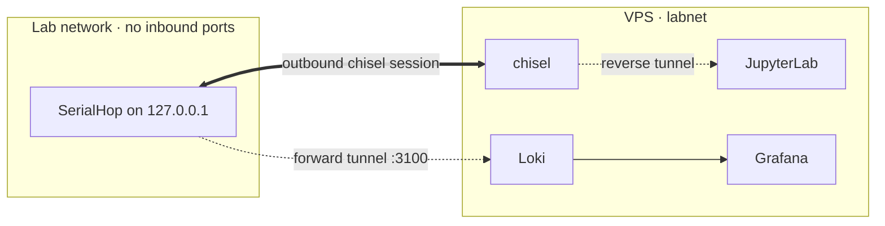

# Network topology

## Topology

The lab PC opens a single outbound chisel session to the VPS and multiplexes everything over it: reverse tunnels publish that lab's REST API into `labnet` so JupyterLab and Flasher can address it by container DNS, and one forward tunnel carries log shipping from SerialHop into Loki. From the lab network's perspective, there is exactly one open TCP connection to a single VPS host on a single port.

## Inbound surface (VPS)

- **80 / 443** — Caddy. TLS via Let's Encrypt.
- **Chisel listen port** — Configured in `config.yaml`. Authenticated per-client.
- Nothing else. Every other service is `labnet`-internal.

## Outbound surface (lab PC)

- **One outbound TCP connection** — chisel session to the VPS. No inbound ports needed on the lab network.
- This is a deliberate design decision; see [security model](/docs/architecture/security).

## Route table

| Path | Service | Auth |
|------|---------|------|
| `/` | siteapp | public |
| `/_static/*` | siteapp | public |
| `/docs/*` | siteapp | public |
| `/download/*` | siteapp | public |
| `/api/agent/upload` | siteapp | bearer token |
| `/api/public/*` | siteapp | public |
| `/login`, `/logout` | siteapp | public (login form) |
| `/api/auth/*` | siteapp | public (firstfactor proxy) |
| `/auth/*` | authelia | public (OIDC + portal) |
| `/jupyter/*` | jupyter | Authelia (any user) |
| `/grafana/*` | grafana | Authelia + OIDC |
| `/flash/api/v1/*` | flasher | bearer token |
| `/flash/*` | flasher | Authelia (admins group) |
| `/_shared/*` | caddy (navbar) | public |

## Internal labnet

Every service runs on the `labnet` Docker network. Service-to-service communication uses container DNS — `http://chisel:<port>`, `http://siteapp:8000`, `http://loki:3100`, and so on — so individual upstreams never need to know about TLS or Caddy. Nothing on `labnet` is exposed to the internet except via Caddy on 80/443 or via the chisel listen port; everything else is reachable only from inside the network namespace.
