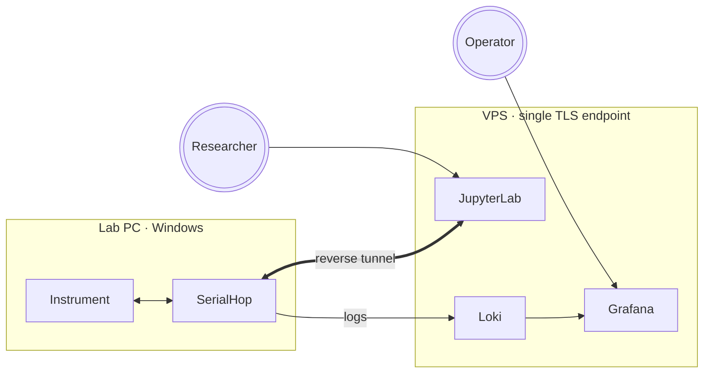

# lab-bridge docs

lab-bridge is a single platform for running and managing remote lab
experiments. Researchers drive bench instruments from a shared JupyterLab;
operators install a small Windows agent (SerialHop) on each lab PC; admins
run the whole thing from one VPS. These docs help you find your way around.

## Find your section

| If you … | Start here |
|---|---|
| just got credentials and want to run an experiment | [Researcher guide](/docs/researcher/) |
| run a lab and want to connect a new lab PC | [Lab operator guide](/docs/operator/) |
| run the lab-bridge server (deploy, users, dashboards, firmware) | [Administrator guide](/docs/admin/) |
| want to understand the network, auth, and security model | [Architecture](/docs/architecture/) |
| are evaluating lab-bridge for an organization | [Architecture](/docs/architecture/) + [Deploying lab-bridge](/docs/admin/deploy) |

## How it fits together

Three pieces — JupyterLab on the VPS (researcher workspace), SerialHop on
each lab PC (Windows agent), Grafana + Loki (observability). The
[Architecture section](/docs/architecture/) goes deep on each.
