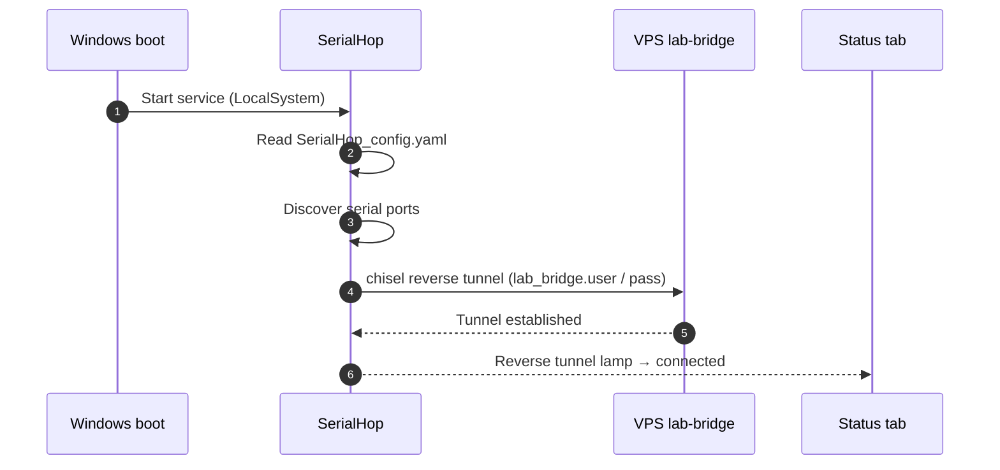

# Set up a new lab PC

This is a one-time install. From a clean Windows 10/11 64-bit PC with the instruments plugged in, you'll have a connected lab in about ten minutes.

## Before you start

- Lab-bridge credentials from your server admin: **host**, **username** (your lab name), and **password**.
- Local Administrator on the Windows PC (registering the Windows service from the panel triggers a UAC prompt).
- The instruments physically connected to USB-serial ports.

## 1. Download and run the SerialHop installer

Visit [`/download/agent`](/download/agent) from any browser. Download the Windows installer (`SerialHop-Setup-v<version>.exe`). Optionally verify the SHA-256 against the value on the download page.

Run the installer and follow the prompts. It places the binary, creates a Start Menu entry and a **SerialHop** desktop shortcut, and prepares `%ProgramData%\SerialHop\` — but it does not register the Windows service yet. That happens from the panel in step 3.

> [!NOTE]
> Windows SmartScreen and your browser may flag the download — SerialHop installers are signed but lack established publisher reputation. The download page explains how to keep the file and bypass the first-run prompt.

## 2. Enter the lab-bridge credentials in the Config tab

Open SerialHop from the desktop shortcut. The panel opens. Switch to the **Config** tab and fill in **lab-bridge**:

- **Host** — the lab-bridge VPS hostname or IP the admin gave you (e.g. `111.88.145.138`).
- **Username** — your lab name. This is the identifier researchers pass to `LabDevicesClient(user=…)` in notebooks.
- **Password** — the random secret the admin generated.

Click **Save**. The panel validates the credentials against the lab-bridge server before writing them to disk — wrong username or password is rejected with an inline error and the save doesn't go through. If the **Host** is unreachable, you'll get a warning dialog asking whether to save the values anyway; only accept if you're sure the host is right and it's a temporary network issue.

## 3. Install the Windows service

Switch to the **Status** tab and click **Install**. Approve the UAC prompt. The service registers, starts at boot, runs as `LocalSystem`, and picks up the credentials you saved in step 2.

## 4. Verify the lab is connected

On the panel's **Status** tab, the **Reverse tunnel** lamp is the source of truth. Once it's **connected**, the lab is online — researchers can reach it. The **Local service** lamp should also be green.

Cross-checks (optional, useful when you're away from the lab PC):

- [The lab-bridge home page](/) lists your lab in the "Registered labs" panel with an ONLINE pill once the tunnel is up. Treat this as a glance, not a diagnosis tool.
- `/grafana/d/lab-bridge-client-logs/lab-client-logs?var-client=<your-lab>` shows the agent's log stream live. The same stream is in the panel's **Logs** tab.

## Boot-time handshake

## If something goes wrong

Always start in the panel — the **Status** tab tells you which subsystem is failing, the **Logs** tab tells you why.

- **Reverse tunnel lamp not connected** — check the **Logs** tab for auth failures or YAML validation errors, then double-check the lab-bridge fields in the Config tab against the credentials your admin gave you (see [SerialHop config reference](/docs/operator/config)). If the credentials were valid when you saved them, the most common cause is the VPS being unreachable from the lab PC's network.
- **Local-service lamp red** — open the **Logs** tab; a YAML validation error names the offending field. Fix it in the Config tab and Save.
- **Devices not detected** — click **Rediscover** on the Status tab. SerialHop re-scans serial ports and picks up any newly plugged-in device without restarting the service. If some boards consistently miss discovery, raise **discovery → Post-open settle** in the Config tab; see [the config reference](/docs/operator/config#discovery).
