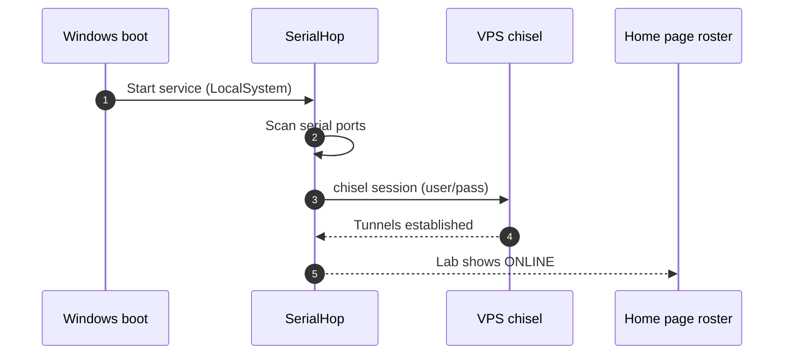

# Set up a new lab PC

This is a one-time install. From a clean Windows 10/11 64-bit PC with the instruments plugged in, you'll have a connected lab in about ten minutes.

## Before you start

- Chisel credentials from your server admin: `user`, `pass`, `host`, `port`, and `remote_port`.
- Local Administrator on the Windows PC (the install registers a Windows service).
- The instruments physically connected to USB-serial ports.

## 1. Download SerialHop

Visit [`/download/agent`](/download/agent) from any browser. Download the Windows installer. Optionally verify the SHA-256 against the value on the download page.

> [!NOTE]
> Windows SmartScreen and your browser may flag the download — SerialHop is a fresh signed binary without yet-trusted publisher reputation. The download page explains how to keep the file and bypass the first-run prompt.

## 2. Place the binary

Copy `SerialHop.exe` to a stable directory — `C:\Tools\SerialHop\` is a good default. Don't put it in `Downloads`, `Desktop`, or any per-user temporary location.

## 3. Edit `SerialHop_config.yaml` before installing the service

```yaml title="SerialHop_config.yaml"
chisel:
  host: <vps-host>
  port: <chisel-port>
  remote_port: <reverse-port>
  user: <lab-name>
  pass: <secret>
```

Replace every value in the example with what the admin issued you. There are five fields: the VPS hostname, the chisel listen port, the per-lab reverse port, your lab's chisel `user`, and the matching `pass`.

> [!IMPORTANT]
> Edit `SerialHop_config.yaml` BEFORE clicking Install. The Windows service starts with whatever config is on disk at install time. A wrong `user` or `pass` silently logs auth failures until the file is corrected and the service restarted.

## 4. Install as a Windows service

1. Double-click `SerialHop.exe`. A small control panel opens.
2. Click **Install**.
3. Approve the UAC prompt. The service registers, starts at boot, runs as `LocalSystem`.

## 5. Verify the lab is online

- Open [the lab-bridge home page](/) and sign in. The "Registered labs" panel should show your lab name with an **ONLINE** pill shortly.
- Open `/grafana/d/lab-bridge-client-logs/lab-client-logs?var-client=<your-lab>` to see the agent's log stream live.

## Boot-time handshake



## If something goes wrong

- Lab stays OFFLINE on the home page → check `SerialHop_config.yaml` against the credentials your admin gave you (see [`SerialHop_config.yaml` reference](/docs/operator/config)).
- Service won't start → open the control panel, click **Open log**, check `SerialHop.log` and `SerialHop_stderr.log` next to the binary.
- Devices not detected → click **Restart** in the control panel. SerialHop re-scans serial ports on each service start, so this picks up any newly plugged-in device. Coordinate with researchers — restart interrupts any in-flight measurement.
