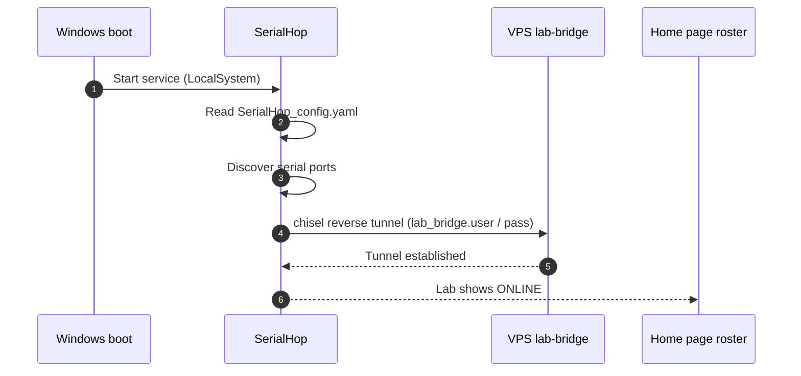

# Set up a new lab PC

This is a one-time install. From a clean Windows 10/11 64-bit PC with the instruments plugged in, you'll have a connected lab in about ten minutes.

## Before you start

- Lab-bridge credentials from your server admin: **host**, **username** (your lab name), and **password**.
- Local Administrator on the Windows PC (the install registers a Windows service).
- The instruments physically connected to USB-serial ports.

## 1. Download SerialHop

Visit [`/download/agent`](/download/agent) from any browser. Download the Windows installer. Optionally verify the SHA-256 against the value on the download page.

> [!NOTE]
> Windows SmartScreen and your browser may flag the download — SerialHop is a fresh signed binary without yet-trusted publisher reputation. The download page explains how to keep the file and bypass the first-run prompt.

## 2. Place the binary

Copy `SerialHop.exe` to a stable directory — `C:\Tools\SerialHop\` is a good default. Don't put it in `Downloads`, `Desktop`, or any per-user temporary location.

## 3. Install as a Windows service

1. Double-click `SerialHop.exe`. A small control panel opens.
2. Click **Install**.
3. Approve the UAC prompt. The service registers, starts at boot, runs as `LocalSystem`.

On first install, SerialHop writes a scaffold `SerialHop_config.yaml` into `%ProgramData%\SerialHop\` with inline comments describing every field. The panel's first-run dialog prompts for the three values the admin issued — **host**, **username**, **password** — and writes them into that file before the service comes up.

## 4. Confirm the credentials in the Config tab

Switch to the panel's **Config** tab. The three fields under **lab-bridge** should now show:

- **Host** — the lab-bridge VPS hostname or IP the admin gave you (e.g. `111.88.145.138`).
- **Username** — your lab name. This is the identifier researchers pass to `LabDevicesClient(user=…)` in notebooks.
- **Password** — the random secret the admin generated.

If anything is wrong (typo, wrong VPS), fix it here and click **Save & restart** — the default save action both writes the YAML and restarts the service so the new values take effect. The field-level validators flag bad input inline (e.g. non-IPv4-or-hostname under **Host**); you can't save until it's clean.

> [!IMPORTANT]
> A wrong username or password silently logs auth failures and the lab stays OFFLINE. There is no popup — you'll see it in the panel's Logs tab.

## 5. Verify the lab is online

- Open [the lab-bridge home page](/) and sign in. The "Registered labs" panel should show your lab name with an **ONLINE** pill shortly.
- The panel's Status tab shows a green **Lab-bridge** lamp once the chisel tunnel is up. **Local-service** should also be green.
- Open `/grafana/d/lab-bridge-client-logs/lab-client-logs?var-client=<your-lab>` to see the agent's log stream live. The same stream is in the panel's Logs tab.

## Boot-time handshake

## If something goes wrong

- **Lab stays OFFLINE on the home page** — open the panel's Logs tab and look for auth failures or YAML validation errors. Then double-check the **lab-bridge** fields in the Config tab against the credentials your admin gave you (see [SerialHop config reference](/docs/operator/config)).
- **Service won't start** — the Local-service lamp on the Status tab stays red. Open the Logs tab; a YAML validation error names the offending field. If the panel itself won't open, read `%ProgramData%\SerialHop\logs\SerialHop.log` (JSON, rotated at 10 MB × 3 backups) and `SerialHop_stderr.log` in the same folder.
- **Devices not detected** — click **Restart** on the panel's Status tab. SerialHop re-scans serial ports on each service start, so this picks up any newly plugged-in device. Coordinate with researchers — restart interrupts any in-flight measurement. If some boards consistently miss discovery, raise **discovery → Post-open settle** in the Config tab; see [the config reference](/docs/operator/config#discovery).
